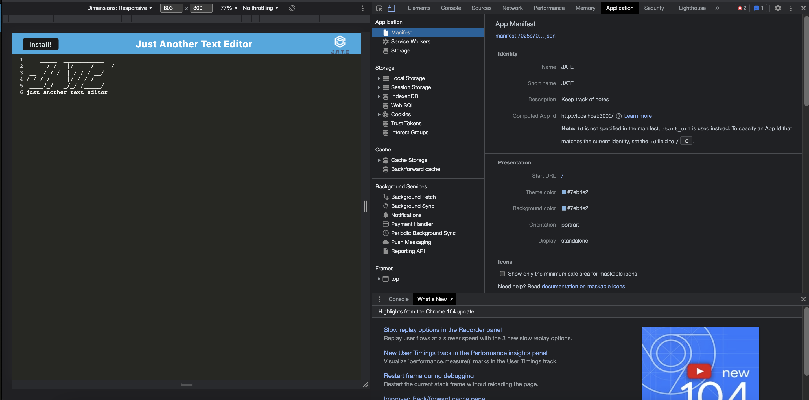

   <h1 align ="center">Social Network Api<h1>


## Description
The task was to creat a Social Networking api backend. Users should be able to create new accounts and users can be found via their id.
# Table of Contents
* [Description](#description)
* [Technologies](#technologies)
* [Installation](#installation)
* [License](#license)
* [Contributions](#contributions)
* [Github](#github)

## Showcase


`Heres the installation prompt for the app`

<br>

`Here is the ServiceWorker for the app`


`Here is the offline capability for the app`


<br>

`Here is the manifest for the app`


## Technologies

<li>PWA</li>
<li>Js</li>
<li>Concurrently</li>


## Installation
clone the repository into your local machine after do the following:

```bash
run website
or 
clone the repository into your local machine after do the following:

npm install
npm run dev
```
## License

<br>
This Project is licensed under the MIT license.

## Contributions


## Github
Questions? 
Contact me through my github Yahir-F

Email: placeholder@gmail.com


    